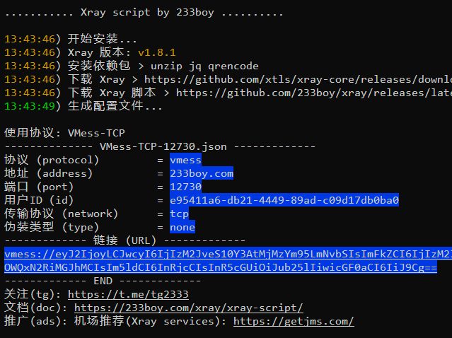
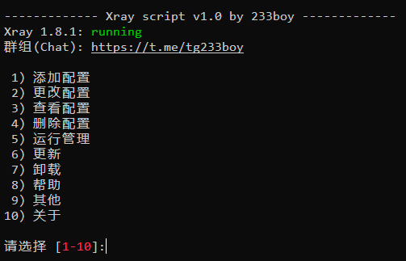
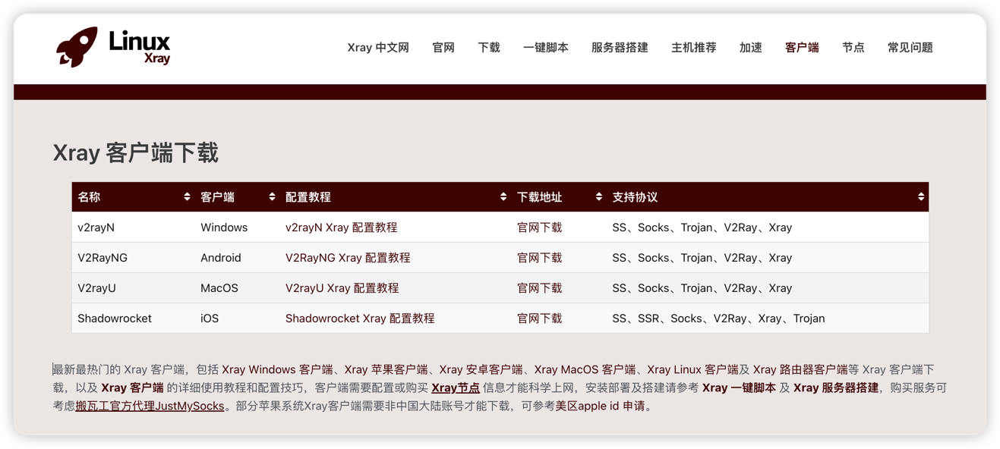
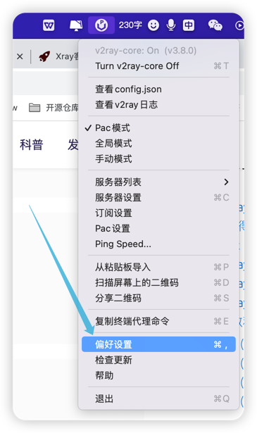
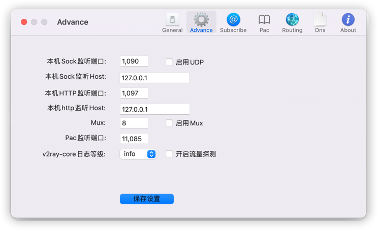

# SelfBuiltVPN-_Xray

->`环境：aws ec2、ubuntu os （ubuntu/images/hvm-ssd/ubuntu-focal-20.04-amd64-server-20230517）、Xray server`

# 一. Xray服务端架设
REF：https://233boy.com/xray/xray-server/

## 1.1. 安装 Xray
```
服务器上执行以下指令：
bash <(wget -qO- -o- https://github.com/233boy/Xray/raw/main/install.sh)
```

## 1.2. 安装完成


## 1.3. 配置（可选）
输入 xray 回车，即可管理 Xra  
  
提示，如果你不想执行任何功能，直接按 Enter 回车退出即可。  


# 二. Xray客户端架设
下载地址：https://www.linuxxray.com/client/  
```
Windows：https://github.com/2dust/v2rayN/releases
Android：https://github.com/2dust/v2rayNG/releases
MacOS：https://github.com/yanue/V2rayU/releases
iOS：https://apps.apple.com/us/app/shadowrocket/id932747118
```


-> 客户端启动过程中，出现以下日志报错：（端口被占用）
```
2023/10/15 02:32:21 [Info] app/dns: DNS: created localhost client
Failed to start: app/proxyman/inbound: failed to listen TCP on 1080 > transport/internet: failed to listen on address: 127.0.0.1:1080 > transport/internet/tcp: failed to listen TCP on 127.0.0.1:1080 > listen tcp 127.0.0.1:1080: bind: address already in use
```
解决办法：更改启动端口  
 